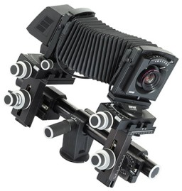
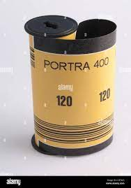
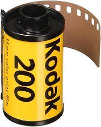
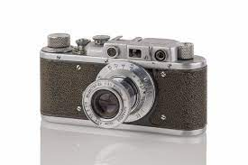
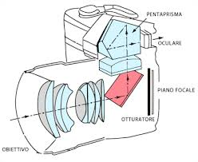
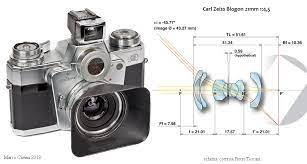
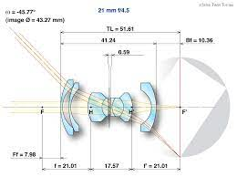
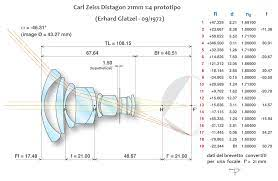
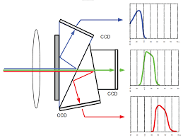

# I sistemi di ripresa (evoluzione delle macchine fotografiche)

Molto probabilmente al solo nominare una fotocamera ci si trova ad evocare l'immagine di una classica Reflex con magari in bella mostra uno di quei nomi storici e blasonati della fotografia mondiale, un po' è il gusto personale, un po' quella particolare e strana alchimia che si ha ad impugnare uno strumento che già solo per il nome stampato riesce in qualche modo a rassicurarti sui risultati.
Le prime fotocamere in verità erano piuttosto lontane da quel concetto, si trattava in sostanza di scatole in legno allungabili con un sistema di lenti piuttosto semplice da un lato e un vetro smerigliato dal lato opposto, il vetro smerigliato permetteva di inquadrare ed una lastra sensibile protetta da una custodia a tenuta di luce permetteva di raccogliere l'immagine tramite l’apertura di una saracinesca, sono sistemi usati ancora oggi (estremamente raffinati nella costruzione e anch’essi ormai digitalizzati), seppure l’immaginario collettivo tende a relegarli ai tempi romantici dell'inizio del secolo scorso.

La prima grande rivoluzione fu l’invenzione del rullo Kodak, disponibile in diversi formati standardizzati adatti a diverse situazioni.

I formati standard favorirono la costruzione di sistemi facili da usare, moderni e modulari con la possibilità di adattare e cambiare ottiche e mirini per far fronte alle situazioni fotografiche più varie. Probabilmente il limite maggiore di questi sistemi era ancora legato al concetto di "inquadratura", ovvero capire con una accettabile precisione e velocità cosa stesse vedendo la macchina, i mirini erano dei sistemi a sé, alcuni particolarmente sofisticati permettevano sia di delimitare automaticamente il campo inquadrato tramite cornici capaci di mostrare in qualche modo il “punto di vista” dell’ottica in uso, sia di assistere il fotografo nella messa a fuoco, ma continuavano a farlo "da fuori".

Le ottiche si erano molto evolute e specializzate per abbracciare porzioni di spazio più o meno ampie. Erano comunque nati i primi sistemi fotografici.
La successiva evoluzione fu il “concetto reflex”, venne introdotto  uno specchio tra l'ottica e la pellicola capace di inviare l'immagine inquadrata in un sofisticato e comodo mirino che finalmente permetteva di vedere in dettaglio ogni sfumatura di quello che effettivamente si stava inquadrando e fotografando, questa fu una grande conquista permessa anche dallo sviluppo di nuovi concetti ottici che finalmente portavano il "punto nodale" (ne riparleremo nei prossimi capitoli) al di fuori del barilotto contenente le lenti, quando tale punto nodale si trovava tra la lente ed il soggetto si parlava di “teleobiettivo”, quando invece il punto nodale si trovava tra le lenti e la pellicola veniva usato il termine “retrofocus” (o in ambito più tecnico parlando dello schema ottico si usava la definizione “teleobiettivo invertito” quasi a dire che si trattava dello stesso concetto semplicemente rovesciato).

Il vantaggio di poter vedere nel mirino ogni dettaglio della fotografia era tale che i pochi problemi da affrontare  divennero insignificanti.
Il primo: ad ogni scatto era necessario alzare, scattare e successivamente abbassare lo specchio, operazioni che con il tempo poi si sono automatizzate questo si traduceva in una discreta complessità meccanica aggiunta, in più portava rumore e vibrazioni e queste ultime in fotografia non sono mai gradite.
Secondo: la camera dello specchio occupava un discreto spazio fisico che poneva grossi paletti a livello ottico per quanto riguardava le ottiche ad ampio angolo di campo. Le uniche concesse sarebbero state le "retrofocus" più complesse, meno costanti nel rendimento a distanza ravvicinata e in sostanza meno economiche.

Tuttavia la grande modularità dei sistemi e la possibilità di vedere quello che la pellicola avrebbe catturato permetteva di estendere facilmente la possibilità di catturare immagini in "ambienti" non necessariamente legati alla fotografia classica. Qualunque sistema poteva facilmente essere usato accoppiato agli strumenti più disparati, telescopi, microscopi, sistemi di riproduzione e qualsiasi settore in cui un'immagine aveva necessità di essere catturata; proprio in un momento storico dominato da una società globale affamata di immagini.
Molti marchi, molti formati, infiniti campi di applicazione, ovvero le caratteristiche classiche necessarie a decretare un successo annunciato, e così in effetti fu. la seconda metà del secolo scorso verrà probabilmente ricordata per il boom della fotografia.
A turbare questi equilibri arriva in un lampo la rivoluzione digitale.
Il digitale nelle immagini era arrivato con la televisione, un fenomeno mondiale inarrestabile capace di divorare a ciclo continuo apparecchiature legate al mondo della diffusione di immagini. Paradossalmente tuttavia nonostante il digitale permeasse le stanze dei bottoni della TV in modo subdolo ed indiretto in apparecchi che lo conservavano silenziosamente al loro interno ci volle qualche anno prima che un timido dispositivo (pensato nei laboratori Kodak) facesse scoppiare la bomba.
In gergo veniva chiamato CCD e per ora ci limitiamo a dire che disponeva di una matrice di elementi sensibili alla luce ed era capace di acquisire una immagine che poi ovviamente sarebbe stata disponibile per la restituzione in vari modi.

Le risoluzioni in gioco relative ai primi sensori montati su una vera telecamera in commercio, paragonate alla realtà odierna del mondo di oggi fanno sorridere, si parla di 330.000 pixel, trecentotrentamila punti sensibili!!!! Possono sembrare pochi, e lo sono, ma vanno chiarite un paio di questioni, in una telecamera (di un certo livello) venivano usati 3 sensori (praticamente identici) incollati rigidamente ad un prisma divisore che in qualche modo filtrava anche la luce affidando ad ognuno una porzione dello spettro della luce visibile. Uno si occupava del rosso, uno del verde ed uno del blu nelle dovute proporzioni, in sostanza ogni immagine complessivamente poteva contare su 990000 pixel! Più o meno 1Megapixel (giusto per avere un numero più adatto alle soglie di comprensibilità odierne).

Va detto che tutto questo era relativo ad immagini destinate alla televisione che da parte sua aveva precisi limiti di risoluzione insiti nel sistema, va anche detto che passarono meno di 2 anni per il primo salto di qualità che vedeva i medesimi sensori già cresciuti a 470.000 pixel,  (senza scomodarsi a giocare con i numeri si tratta di un ragguardevole +30% relativo a macchine di ampia diffusione già sul mercato).
I sensori di immagine furono uno dei settori soggetti a maggiori investimenti negli anni 90, i processi di produzione erano appannaggio di aziende che si occupavano di semiconduttori e di pellicole fotografiche, queste ultime pur apparentemente lontane dal mondo dei semiconduttori avevano in alcuni processi di produzione (drogaggi dei materiali) delle insospettabili similitudini, tuttavia ovviamente i produttori di semiconduttori pur non disponendo delle straordinarie competenze specifiche di una Kodak o Fuij nel settore del trattamento delle immagini e della colorimetria in pochi anni si sarebbero trovati a godere di una forza industriale e produttiva tale da essere praticamente senza concorrenti.
Kodak tuttavia anche stavolta nel settore fotografico fece da precursore e uscì sul mercato con macchine costruite intorno a corpi (e sistemi) Nikon e Canon. Le risoluzioni erano già mostruosamente più alte di quelle destinate al video, già nel 1991 il primo sensore destinato ad una reflex regolarmente in distribuzione poteva contare su una densità di 1.300.000 pixel disposti su una superficie ampia ma non tanto quanto la pellicola, situazione che poneva dei problemi relativi al campo inquadrato, lo stessa ottica portata sulla macchina digitale perdeva tutta la parte periferica del proprio campo inquadrato ed era un problema.
Qualcuno decise che per il digitale sarebbe stato conveniente ricominciare da zero e costruire un sistema pensato "in digitale per il digitale", in cui la macchina era il cervello base e ogni periferica connessa, dalle ottiche ai flash sarebbe stata capace di un dialogo bidirezionale con la cpu centrale,  nacque il formato 4/3 uno standard aperto frutto di un consorzio pensato per fare in digitale tutto quello che si poteva fare con una reflex standard su pellicola 35mm (riferita alla larghezza della pellicola utilizzata, il formato del rullo si chiama 135) di fine secolo con ovviamente tutte le facilities e le nuove possibilità permesse dal digitale, tutto contenuto in un sistema di dimensioni più compatte. Le caratteristiche di base di questo nuovo formato erano state derivate da approfonditi studi circa le nuove possibilità permesse dal digitale, e dai nuovi limiti che si cercava in qualche modo di superare:

1. Il formato scelto era scandalosamente piccolo, specie in un periodo in cui le aziende mostravano al mondo che loro ”lo avevano più grosso”; era un quarto del vecchio 35mm, scelta effettuata in base a due motivi:
    1. Passando in digitale si sarebbe ottenuto un aumento di qualità dovuto ad un paio di fattori, da un lato l’efficienza del sensore sarebbe stata enormemente maggiore di quella della pellicola, dall'altro la disposizione ordinata e la possibilità di controllo totale di ogni singolo pixel avrebbe eliminato l’effetto di “scarsa nitidezza” tipico della disposizione casuale della granulosità della pellicola. I dubbi che nutrivano gli utilizzatori abituati alla pellicola era se passando al digitale si sarebbe riusciti a mantenere la qualità della pellicola, quelli degli sviluppatori erano invece di quanto sarebbero migliorate le immagini passando al digitale, le stime di allora lasciavano intendere che in uno stesso formato usato abitualmente con la pellicola passare al digitale sarebbe stato come scattare su una superficie 4 volte maggiore, stima pessimistica, oggi si parla di un fattore 5 e va considerato che lo sviluppo dei sensori digitali non è stato interrotto.
    2. Le ottiche del sistema sono costruite in relazione al formato del sensore, per rendere facile associare una lunghezza focale al relativo angolo di campo ci si sarebbe dovuti riferire a numeri noti, quelli dei sistemi reflex da 35mm lo erano e per un formato ridotto ad  ¼ le lunghezze focali relative si sarebbero semplicemente dimezzate, per cui un 50mm in un formato 135  avrebbe avuto identico angolo di campo di un 25mm in un 4/3.
2. Un problema del digitale è la polvere sul sensore che al contrario della pellicola, che è sempre nuova, può restare ben presente e attaccata al sensore  per migliaia di scatti, fu inserito un sistema per eliminare la polvere (che oggi è presente su tutte le macchine)
3. In digitale non c’erano grandangoli, sia perchè i sensori erano più piccoli che per un nuovo problema dovuto alla differenza di costruzione della pellicola rispetto al sensore elettronico, con i nuovi sensori la normale caduta di luce ai bordi di un grandangolare veniva accentuata in maniera inaccettabile, fenomeno dovuto sia alla “pupilla di uscita” delle ottiche comunemente usate fino ad allora (ne riparleremo) che alle angolazioni tipiche dei “raggi” in uscita dall'ottica verso il sensore di un'ottica a focale corta. Il 4/3 prevedeva per standard una precisa dimensione della lente posteriore e della pupilla di uscita, per fare in modo che il sensore fosse colpito da raggi quasi paralleli. (in gergo tali ottiche vengono definite telecentriche, sono destinate ad usi industriali molto particolari, non sono parte della cultura dell'ottica fotografica)
4. Tutti i sottosistemi, dalle ottiche ai flash nascevano dotati di una propria elettronica di bordo, di un proprio firmware con cui poter essere aggiornati e della capacità di dialogare bidirezionalmente con la CPU.

Ho citato il 4/3 solo perchè è stato il primo sistema pensato da zero per il digitale, in seguito praticamente tutti i sistemi sarebbero stati “costruiti o ricostruiti” da zero pensati per le nuove funzioni del digitale. nel 2008 il 4/3 sarebbe poi “virato” nel m4/3, ma ne parleremo in seguito.
In pochissimi anni il mercato avrebbe offerto una vasta scelta di marchi, prezzi e “risoluzioni”, il numero di pixel disponibili ora intorno ai 10M (a seconda dei modelli) sarebbe cresciuto con una certa continuità e il vecchio caro CCD avrebbe trovato un degno concorrente nel CMOS.

Sulle differenze tecniche tra i due tipi di sensore torneremo in un secondo momento, quello che ci serve sapere ora è che i CMOS di ultima generazione (parliamo del 2008) a fronte di una certa “minore uniformità di resa” tra i vari pixel rispetto al CCD (per la verità a livelli ormai veramente bassi) disponevano di una velocità di trasferimento nettamente superiore, ora sufficiente a fornire in uscita oltre ad una immagine statica a piena risoluzione anche un flusso video (letto anch’esso dall’intera matrice di pixel), queste nuove generazioni di sensori si apprestavano a portare nel mondo della fotografia l’ultimo scossone.
Era il 2008 e uno dei giganti dell'elettronica mondiale (Panasonic) era da poco entrato nel mondo della fotografia per rafforzare la sua posizione in quello del video, analogamente a quanto stava facendo Sony; i due dominavano il mercato mondiale, Sony più orientata al mercato Broadcast e Panasonic verso quello delle piccole produzioni. Panasonic capì subito le potenzialità di un nuovo concetto e insieme ad Olympus diede vita ad un nuovo format di fotocamera digitale derivato dal 4/3 e rinominato m4/3 (micro4/3) a cui avevano sottratto definitivamente la scatola dello specchio e il mirino ottico, le classiche funzioni di una reflex passavano per dei processi elettronici permessi dal flusso video fornito dai nuovi sensori che confluivano in un sofisticato mirino elettronico oltre che ovviamente al bisogno in uscita o semplicemente registrati come video erano nate le “mirrorless”.
A prima vista non furono in molti a “gioire della novità”, l’intera industria fotografica sembrava concentrata a minimizzarne i vantaggi, per qualcuno tale sistema era nato morto e prevedevano già un futuro  relegato al massimo a sistemi molto economici adatti a pochi soggetti,i dati di oggi raccontano una realtà piuttosto diversa, dopo 14 anni dal primo modello tutti i costruttori hanno messo in catalogo fotocamere mirrorless (questa volta tutte ripensate da zero per il digitale) e quasi tutti hanno rinunciato (e/o stanno rinunciando) al mercato delle reflex; quello stesso mercato che era sopravvissuto persino alla rivoluzione digitale.
I motivi sono in verità piuttosto semplici, togliere lo specchio permette a livello ottico di arrivare con “l’ultima lente” ad un soffio dal sensore, cioè usare grandangoli veri (non retrofocus) capaci di prestazioni eccellenti anche a costi molto inferiori, la facilità con cui su una stessa macchina si possano montare le ottiche più disparate da quelle nate per la cinematografia professionale a quelle recuperate da un qualsiasi sistema del 1940 (ovviamente rinunciando ad alcune funzioni automatizzate) è disarmante. Le macchine sono molto più compatte, i mirini (ormai di qualità assoluta) permettono di vedere lo scatto (non quello che “si suppone verrà”) prima di farlo, l’assenza dello specchio permette di girare video ad altissima risoluzione e nel contempo scattare foto senza nessun limite che non sia il sensore stesso, per passare dalla modalità “foto” a quella “cine” (non si dovrebbe più parlare di video in quanto le prestazioni sono al livello della cinematografia professionale, sia come formato del sensore che come risoluzione) basta premere un tasto, in aggiunta alcune funzioni impensabili solo pochi anni fa oggi sono permesse anche da macchine “standard”.
Non mi sono soffermato sui vari automatismi di controllo entrati nel mondo della fotografia perché si tratta di dettagli di contorno che per quanto oggi irrinunciabili sono relativi alla facilità di uso di una fotocamera più che al concetto stesso di sistema di ripresa fotografica.
Sostanzialmente oggi il mercato fotografico è dominato da mirrorless di ogni formato, marchio e qualità, tutto quello che era stato appannaggio di compatte tascabili, di fatto è svolto in modo egregio (con un notevole surplus di funzioni) da un comune smartphone. Esiste un denominatore comune a tutti questi dispositivi, sono tutti digitali. Per la verità è ancora vivo un mercato parallelo fatto di appassionati, nostalgici e sperimentatori dove le macchine sono ancora meccaniche e le pellicole sono ancora reperibili, dove si scatta e talvolta si sviluppa in camera oscura, un mondo che incuriosisce alcuni e lascia un nostalgico amaro in bocca ad altri, personalmente avendo vissuto entrambe le realtà non saprei dire quale sia “giusta” sono mondi diversi ed ognuno a suo modo è capace di stupire.
