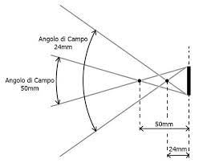

# Ottiche

"Fotografare" parola composta che letteralmente significa "disegnare con la luce", bella cosa la filosofia, ottimo concetto, ma poi prenderla quella luce, tenerla in mano e spalmarla su un foglio di carta….. già… filosofia…!
Che poi a guardar bene con gli occhi spalancati e volendo essere precisi la luce di suo non è che si vede, noi al più riusciamo a vedere degli oggetti illuminati ma non vediamo la luce che li illumina…(ecco qui un po' di filosofia non guasterebbe). Forse dovremmo chiederci se sia vero o no che le immagini esistono o se magari non siano altro che una nostra illusione, cresciuta e sviluppata per aiutarci a descrivere l'aspetto delle cose che ci circondano, se così fosse si tratterebbe di certo di una illusione collettiva, generalizzata, e sempre se così fosse più che disquisire su cosa sia questo o quello forse sarebbe conveniente approntare degli strumenti che possano permetterci di raccogliere immagini non troppo diversamente da quanto facciano quotidianamente i nostri sensi. Forse in definitiva un'ottica non fa niente di più né niente di meno di questo.
Ma siamo sicuri che sia necessaria?
Proviamo a procedere con ordine partendo da un ambiente grande ben illuminato e pieno di tanti oggetti, facciamo in modo di costruirci dentro una grossa scatola cubica chiusa dove la luce non ha modo di entrare (chiamiamola “camera oscura”) e giusto per essere sicuri che là dentro è completamente buio entriamo e verifichiamo di persona. Buio pesto, ma… no aspettate, vedo un forellino piccolo piccolo su una delle pareti verticali, proprio nella zona centrale, c'è un po' di polvere svolazzante illuminata dalla moltitudine di raggi che entrano, ognuno con una direzione precisa, ma verso cosa? Faccio per girarmi per seguirli e resto esterrefatto dallo spettacolo, proiettata sulla parete opposta c'è una immagine grande come la parete e si vedono tutti quegli oggetti che erano là fuori ma sottosopra….!
Ok! il film è finito.
Diciamo che in epoca medievale questo poteva succedere visto che le camere oscure venivano già usate, dicono dai pittori per velocizzare i lavori ed essere più realistici. Il punto è che un foro sufficientemente piccolo può benissimo essere usato per raccogliere un'immagine su una superficie, più sarà piccolo più saranno sottili i raggi che lo attraversano e più i dettagli riprodotti saranno fini, ma più sarà piccolo e meno luce lascerà passare, e meno luce significa…buio.
E se invece usassimo una lente?
Anche le lenti esistono dal medioevo, ma per arrivare a conoscerle davvero c'è voluto un po'.
A conti fatti già alla fine del 1800 tutta la matematica relativa all'ottica era stata ben esplorata, esistevano alcune (poche) varietà di vetri adatti e la fisica aveva già fornito una bella base scientifica su cui lavorare, restavano però calcoli estremamente lunghi e complessi, i computer non erano ancora neanche immaginabili, la precisione delle lavorazioni e delle misure era quella permessa al tempo, ma qualche colpo di genio qua e là era già reperibile. Mancava giusto qualcosa per far decollare l'industria ottica, ma si sa come vanno queste cose… tra una guerra e l'altra tutti sono ansiosi di ricevere nuovi dispositivi che il nemico ancora non ha e nel 1900 non sono certo mancate le guerre.
In fotografia si usa di tutto, dal foro stenopeico (già… il famoso buco della camera oscura di cui parlavamo prima) alle vecchie lenti degli occhiali del nonno, alle ottiche più insospettabili, oltre ovviamente a quelle che poi gli stessi produttori forniscono e spiegano con dovizia di particolari.
Una ottica fotografica in sostanza è una sorta di "buco virtuale" che pur riuscendo a far passare tanta luce resta finissimo nel dettaglio.
Ora diamo un'occhiata all'immagine seguente, ponendo attenzione al punto nominato N', quello che in fotografia può essere considerato il "sostituto" del foro stenopeico nella camera oscura.
Se noi ponessimo un centro di rotazione esattamente sul punto N’ e ruotassimo la lente (o eventualmente un'ottica fatta da un gruppo di lenti, esisterà comunque un punto N’ risultante del tutto simile a quello citato ora) il soggetto AB resterebbe fermo per definizione, ma anche la sua immagine A’B’ non accennerebbe ad alcun movimento.

La posizione del punto nodale non viene geometricamente definita da niente altro che dalla potenza della lente e dalla sua distanza dal soggetto; tale distanza ha una sorta di "limite massimo" chiamato in gergo fotografico "infinito" (ben evidenziato nella quasi totalità delle ottiche che incorporano un meccanismo manuale di aggiustamento del “fuoco”) che quando raggiunto è tale che i raggi che viaggiano da AB verso la lente possono praticamente essere considerati paralleli. In questa precisa condizione, la distanza tra il punto nodale (N’) ed il piano ortogonale all’asse ottico dove si raccoglie l’immagine A’B’ (che chiamiamo “piano di messa a fuoco”) è quella minima possibile; esattamente questa distanza viene definita "lunghezza focale" dell' ottica e viene convenzionalmente espressa in mm.
E’ piuttosto intuitivo il rapporto tra questa lunghezza e l'angolo di campo abbracciato dal sistema. Data una precisa misura del "sensore" (o pellicola che sia) una lunghezza focale minore produce un “angolo di campo” più ampio, viceversa una lunghezza focale maggiore produce un “angolo di campo” più stretto.

Il fatto che N' sia dipendente dalla potenza della lente e dalla distanza dal soggetto porta a delle conseguenze:

1. Poniamo che il soggetto AB del disegno precedente sia il “primo dei soggetti, visti dalla lente a distanza infinita”, presente davanti alla lente (o gruppo ottico), ogni altro oggetto X (che risultasse visibile nel campo inquadrato) posto tra la lente e AB produrrebbe una corrispondente immagine X’ posta ad una diversa (maggiore) distanza dalla lente, se volessimo raccogliere questa immagine dovremmo necessariamente portare il “piano di messa a fuoco” in corrispondenza della sua immagine X', in pratica è come se ogni distanza compresa tra la lente e il primo soggetto “all’infinito” AB disponesse di un unico, proprio, personale piano di messa a fuoco, l'unico in cui la relativa immagine potrebbe essere raccolta. 
2. Allontanando il soggetto X dalla lente otterremo una diminuzione della distanza tra la lente e l'immagine X’. Raggiunta la distanza dove è posto il soggetto AB (che per convenzione abbiamo considerato “posizionato all’infinito”) avremmo l’immagine A’B’ alla minima distanza dalla lente, l’immagine di qualsiasi soggetto posto ad una distanza maggiore di AB sarebbe raccolta nel medesimo “piano di messa a fuoco” di A’B’. Potremmo dire che un sistema ottico “impone” la necessità di scegliere a quale precisa distanza dalla lente si vuole in qualche modo dare una “preferenza”. Questa operazione è chiamata “messa a fuoco”, e permette di ottenere l'immagine del soggetto scelto alla massima nitidezza permessa dal sistema. Posto il sistema davanti ad un soggetto X diventa necessario traslare il piano del sensore nell’unico punto in cui la sua immagine X’ può essere raccolta, questa operazione quasi sempre è sostituita dalla più semplice traslazione dell’ottica o di una parte di essa, considerate le distanze in gioco uno spostamento di pochi millimetri del gruppo ottico produce praticamente un risultato del tutto simile allo spostamento del sensore senza le complicazioni meccaniche e di uso necessarie a quest’ultimo.
3. Consideriamo ora due lenti con medesima potenza (stessa “lunghezza focale”) ma di diverso diametro. Quella più grande raccoglie più luce,  produce di conseguenza un'immagine più luminosa. Proviamo con entrambe le lenti a “mettere a fuoco” un soggetto X posto non troppo vicino né troppo lontano dalla lente,  un eventuale punto Y posto a distanza lievemente maggiore o lievemente minore non potrà evidentemente risultare “a fuoco”, con la lente piccola si otterrebbe una immagine di una certa luminosità dove il soggetto X’ risulterebbe perfettamente a fuoco e quel punto Y’ seppur meno nitido ancora distinguibile, passando ora all'immagine della lente grande sarà evidente una maggiore luminosità della precedente, il soggetto X’ risulterà comunque perfettamente a fuoco, ma quel punto Y’ molto meno nitido del caso precedente.
4. Ma se le lenti pur avendo lo stesso diametro avessero una diversa potenza? (cioè diversa lunghezza focale), anche in questo caso quel medesimo punto Y produrrà nei due casi due immagini di diversa nitidezza, quella con lunghezza focale maggiore (lente meno potente) produrrà un'immagine Y' meno nitida. In questo caso un paragone diretto non è del tutto corretto come esempio, le immagini raccolte sarebbero molto diverse perché gli angoli di campo sarebbero molto diversi; tuttavia, la “profondità di campo” (quell’intervallo di distanze intorno al soggetto in cui tutto quello che c’è risulta sufficientemente nitido), dipende strettamente (e geometricamente) dalla lunghezza focale e dalla dimensione della lente. Due ipotetici sistemi diversi costruiti con elementi sensibili di dimensioni diverse che usassero due ottiche diverse ma capaci di inquadrare il medesimo angolo di campo (per cui lunghezze focali diverse come il caso in questione) produrranno due differenti immagini in cui lo stesso punto Y’ risulterà tanto meno nitido quanto maggiore sarà la lunghezza focale, per cui il sistema con formato maggiore (che usa lunghezze focali maggiori) produrrà immagini con profondità di campo minore.

Queste peculiarità determinano tutte le variabili (ottiche) amate dai fotografi nella fotografia, l’ottica non a caso è considerata il primo fattore di scelta relativamente ad uno scatto. Un’ottica permette al fotografo di “modulare” ben altro che la luce, un’ottica è responsabile di dare al soggetto un “respiro”, di portarlo in un contesto e di rimuoverlo da un contesto, di circondarlo da un alone fatto di immaginazione o di buttarlo con violenza in una cruda realtà.

## Luminosità di una lente

Poco sopra abbiamo accennato alla possibilità di usare diversi diametri di lente per raccogliere più o meno luce, detto in questi termini è tutto piuttosto vago, per cui cerchiamo di chiarire cosa succede in pratica.
Per semplicità usiamo come sopra una singola lente convergente.

I raggi paralleli in ingresso mostrano chiaramente che “dal punto di vista della lente”, il punto da cui quei raggi provengono è posto  “all’infinito". Per attraversare la lente si imbattono con una superficie variamente angolata di un materiale di differente densità che li costringe a variare la propria direzione, poco dopo tornano ad incontrare un secondo materiale di differente densità separato ancora da una superficie variamente angolata e inevitabilmente cambiano ancora una volta direzione. Alla fine finiscono per trovarsi in quel “punto di fuoco” (focal point) insieme a tutti gli altri infiniti raggi provenienti dal medesimo punto del medesimo soggetto. Ora, se avvicinassimo il soggetto ad una distanza ragionevolmente breve, vedremo chiaramente che da ogni singolo punto (che possiamo chiamare P) del soggetto, parte un intero cono di luce che investe la totalità della superficie frontale della lente, e di conseguenza dalla stessa lente, vedremo uscire un altro cono di luce che da ogni punto della superficie di uscita della lente arriverebbe a convergere nel corrispondente punto di fuoco P’. Nella maggior parte delle situazioni reali un'ottica fotografica è costituita da più lenti, ognuna calcolata e posizionata con la massima precisione possibile, questo il più delle volte influisce sul diametro effettivo dei due coni di luce in entrata ed in uscita dall'ottica, che possono avere un diametro alla base anche molto diverso dalle lenti esterne del gruppo, la misura della base di quello riferito all'uscita dal gruppo ottico determina la dimensione della "pupilla di uscita", che pur essendo piuttosto importante in sistemi ottici tipo binocoli o cannocchiali, in fotografia ha acquisito una certa importanza solamente  con l'arrivo dei sensori digitali. Questi essendo praticamente bidimensionali tendono a “leggere con maggiore evidenza” la perdita di luminosità di raggi molto angolati (tipicamente quelli in uscita dalle ottiche grandangolari) "costretti" ad illuminare con un raggio di dimensioni finite, porzioni di spazio sempre maggiori, via via che aumenta l'angolo di incidenza. Con le pellicole questo fenomeno non era evidente in quanto le relative particelle sensibili erano  tridimensionali distribuite in una struttura per quanto sottile (e quasi trasparente) ancora tridimensionale.
Ogni singolo raggio di luce contribuisce alla luminosità dell’immagine raccolta in P’; se semplicemente usassimo una lente con un diametro tale che la sua superficie risulti dimezzata la quantità di luce risulterà in teoria anch’essa dimezzata, se d’altro canto ponessimo in prossimità della lente delle maschere che possano parzializzare la superficie della lente per usarne una parte sempre minore avremmo ottenuto un modo per lasciar passare sempre meno luce. Questo dispositivo esiste e viene comunemente chiamato “diaframma”.
Per esprimere la luminosità di un'ottica tramite il diaframma viene convenzionalmente usato un numero adimensionale che esprime semplicemente il rapporto tra la lunghezza focale di una lente e il “diametro utile” della stessa, per esempio un’ottica con lunghezza focale di 50mm ed un diametro di apertura di 50mm convenzionalmente verrebbe definita 50mm f1.
Un'ottica che permette di poter controllare l'apertura del diaframma deve ovviamente disporre di un preciso comando e di una altrettanto precisa scala di riferimento. 
Per convenzione la ghiera di controllo del diaframma prevede dei riferimenti precisi a intervalli precisi definiti "stop", ad ogni "stop" la superficie aperta davanti alla lente viene dimezzata, il numero che indica ogni stop inizia con il valore f relativo al diaframma completamente aperto, ad ogni stop successivo ogni numero viene semplicemente moltiplicato per √2.
Usando i valori ipotizzati in precedenza avremmo una lunghezza focale di 50mm, un valore di apertura massima f 1 e sulla ghiera sarebbe presente questa sequenza di numeri: 1; 1,4; 2; 2,8; 4; 5,6; 8; 11; 16; 32, può sembrare strano che ad un numero maggiore corrisponda una superficie minore, ma il problema è che quel numero era in origine il denominatore, fosse stato ancora  presente il numeratore i valori sarebbero stati i seguenti: 1/1; 1/1,4; 1/2; ½,8; 1/4; ⅕,6; ⅛; 1/11; 1/16; 1/32) Con la vecchia dicitura le indicazioni erano molto più chiare.
Sulle moderne macchine digitali un raddoppio o un dimezzamento della superficie dell'apertura risulterebbe eccessivo per cui si è scelto di dividere ulteriormente ogni stop in tre/terzi di stop, ma le indicazioni numeriche “originali” restano di norma come riferimento.

## Schemi ottici

Le ottiche sono strutture complesse costruite con elementi fragili e difficili da lavorare, per cui ogni singolo elemento viene pensato, costruito e montato per una precisa dimensione e collocazione.
Per quanto possa essere significativo un dato come la lunghezza focale, questo deve essere contestualizzato al formato ed al relativo angolo di campo che deve coprire. Un 65mm può essere pensato e costruito in molti modi, se dovesse coprire una lastra fotografica 10x12 cm (la cui diagonale misura 156mm) sarebbe un grandangolo molto spinto, se fosse pensato per una telecamera broadcast da ⅔ di pollice (in cui la diagonale del sensore non arriva a 17mm) sarebbe una focale molto lunga fatta per abbracciare angoli di campo molto stretti.
Il primo schema ottico da citare per ordine di importanza è senza dubbio il “doppio Gauss”, opera del celebre matematico e probabile capostipite dell’ottica fotografica moderna, “doppio” in quanto lo schema originale di Gauss era costituito da due lenti a menisco separate, positiva e negativa, ottica nata per i telescopi. Venne raddoppiata da qui il termine “doppio”.

Una prima variante significativa è conosciuta sotto il nome Petzval, il primo schema ottico sviluppato su basi matematiche. Non sarebbe neanche corretto associare il nome Petzval ad uno schema ottico, potremmo dire che è stato il primo degli ottici moderni, quelli capaci di prevedere il comportamento di un gruppo ottico effettuando opportuni calcoli… Sono ancora in produzione “repliche” di un celebre Petzval da ritratto.
Il problema fondamentale era cercare di minimizzare alcuni dei limiti che una singola lente si porta dietro, ora stare a fare un elenco delle caratteristiche indesiderate può essere poco utile, ma vale la pena vedere qualche situazione.
Quella mostrata in basso è detta “aberrazione cromatica” e si tratta di un fenomeno che accompagna per definizione una singola lente, il fatto è che la quantità di deviazione che un raggio di luce è costretto a fare dal suo percorso dipende dalle differenti densità dei materiali che attraversa, dall’angolo di incidenza con la superficie di tali materiali e dalla lunghezza d’onda della luce, ovvero dal suo colore. Già solo restando nello spettro visibile della luce bianca, avremmo punti di fuoco a distanze diverse dalla lente,  che detto in un altro modo significa diverse immagini (per diversi colori) che non si sovrappongono esattamente. Nella prima metà del secolo scorso questo era un problema del tutto secondario, dato che le pellicole disponibili non riuscivano a mantenere una sensibilità accettabile a tutte le lunghezze d'onda della luce visibile, poi con i continui miglioramenti la situazione è molto cambiata.
La “quantità di deviazione in base al colore della luce” ha un nome sempre più usato nell’ottica moderna: “dispersione”.
Esiste una moltitudine di vetri ottici, alcuni rientrano in una categoria detta a “dispersione anomala”; in sostanza non si comportano come la lente standard dell'immagine sotto in cui la dispersione è proporzionale alla lunghezza d'onda; oggi le aziende li chiamano in vari modi perché comunque vada un nome rassicurante "fa marketing", dal classico “bassa dispersione” a “molto bassa dispersione” a “ultra bassa dispersione” ecc.

Al fotografo di come viene nominato il vetro importa relativamente, serve più che altro a restare ancorato alla speranza di poter capire un giorno perché mai un’ottica debba costare quanto un'utilitaria di medie dimensioni, al progettista serve a superare i limiti di un progetto; nella foto sopra è evidente quanto un'accorta progettazione possa limitare un problema.
Torniamo al Gauss e vediamo come è stato migliorato a tal punto da restare praticamente invariato per più di un secolo, seppure declinato in alcune varianti dovute ad un sempre maggiore affinamento dei vetri e delle lavorazioni.

Questo è “sua maestà” il Planar creato nel 1896 da Paul Rudolph della Zeiss, derivato dal Gauss, ancora oggi usato nella quasi totalità di ottiche simmetriche a medio angolo di campo, permette di annullare praticamente ogni limite tipico di una singola lente, le differenze che il mercato offre (a costi molto diversi tra loro) riguardano più che altro il comportamento relativo ai raggi che arrivano molto angolati rispetto all’asse ottico, gli unici che questo schema ottico “non corregge d’ufficio”. Sotto alcune realizzazioni costruite e vendute anche cento anni dopo… non credo sia il caso di aggiungere altro.

Questo schema ottico abbraccia un angolo di campo piuttosto ampio, tipicamente è usato fino a 50/60 gradi ma con degli opportuni (pesanti) aggiustamenti è stato traslato con successo verso angoli di campo ben più ampi, quello sotto è stato considerato per tutta la seconda metà del secolo scorso il miglior grandangolo mai costruito. Montato su una macchina costruita apposta (Hasselblad SWC).

A guardar bene altro non è che un Planar in cui ogni elemento interno è stato sostituito dal suo relativo “negativo”  ogni lente convergente è diventata divergente pur mantenendo nell’insieme una certa “identica logica di pensiero”.
Ora arriviamo alla situazione opposta in cui gli angoli di campo sono molto stretti, anche in questo caso come esempio usiamo l'ottica a lunga focale considerata per anni il riferimento assoluto, il Leitz Telyt 800mm f6,3

Un unico gruppo ottico costituito da tre elementi cementati insieme, il limite di questo schema è che il gruppo ottico doveva essere posizionato molto lontano dalla pellicola (oggi si direbbe sensore), e questo con il tempo è diventato un problema, ottica straordinaria ma molto ingombrante e anche stavolta costosissima.
Comunque sia ragionando su questa tipologia “detta tripletta” alcuni progettisti sono arrivati al prossimo, conosciuto come "tripletta di Cooke", o anche "tripletta di Taylor" o ancora "tripletta di Taylor Hobson" Originale del 1902 potrebbe essere considerato il secondo schema ottico più usato a livello di produzione mondiale.

Famosissimo il “derivato” seguente: il Tessar Zeiss

Si tratta di tipologie di ottiche molto diffuse perché semplici economiche e facili da produrre pur essendo capaci di prestazioni notevoli, il Tessar era soprannominato “occhio d'aquila" per la sua capacità di restituire i dettagli, questo già lascia intendere parecchio.
Ultima variabile che può valere la pena citare è quella relativa al tentativo di superare il limite principale per questa tipologia ottica, lo scarso angolo di campo. Qualcuno riuscì anche in questo, eravamo intorno alla metà del secolo scorso e fu presentata e commercializzata una fotocamera molto particolare dotata di ottica fissa con un “mostruoso” per l’epoca angolo di campo di 110 gradi, costruito sulla base di una “tripletta invertita”, non aveva alcuna possibilità di montare un diaframma, la luminosità era fissa ad f8  per rimediare alla altissima caduta di luce ai bordi era dotato di serie di un filtro neutro sfumato verso i bordi che annullava tale effetto, da un punto di vista della distorsione dell’immagine a tutt'oggi resta insuperato. In rete sono reperibili molte immagini riprese da questa ottica, ancora oggi assolutamente disarmanti

Dovremmo citare quelle che personalmente  chiamo le “evoluzioni funzionali” a cui abbiamo accennato nel precedente capitolo. i teleobiettivi ed i retrofocus, nati per far fronte a degli impedimenti fisici, i primi per accorciare lo spazio occupato dalle focali lunghe e rendere la macchina più compatta ed utilizzabile, i secondi come accennato in occasione dello specchio reflex per guadagnare uno spazio fisico altrimenti impossibile da ottenere.
Questo è lo schema ottico di un 300mm (per formato 135) un teleobiettivo piuttosto lungo, non è evidenziata la posizione della pellicola (sarebbe piuttosto arretrata) ma è evidente la forte asimmetria della costruzione. 

Anche nell'immagine sotto (già vista in precedenza) risulta evidentissima la forte asimmetria di un sistema retrofocus, Queste marcate asimmetrie rappresentano le gioie e i dolori dei “teleobiettivi” e dei “teleobiettivi invertiti”. Da un lato il guadagno fisico può essere insostituibile, dall’altro (specie nel caso dei grandangoli) la perdita della simmetria del gruppo è spesso accompagnata da una minore costanza di rendimento con soggetti a breve distanza. Esistono eccellenti grandangoli retrofocus, ma pagano comunque delle “sfumature”  nei confronti di quelli nati a costruzione simmetrica. Va anche detto che la stessa maggiore presenza di vetro, e le stesse maggiori dimensioni dei vetri sono già responsabili di un certo “scadimento” delle prestazioni. A parità di schema ottico le ottiche per formati minori offrono un netto vantaggio a livello di prestazioni.

Non abbiamo parlato di focali variabili oggi presenti in ogni corredo né di ottiche specialistiche costruite per gli usi più particolari, in realtà non c'è neanche molto da dire, questa carrellata non vuole certo minimizzare le reali difficoltà nel progettare e produrre certi capolavori, né tantomeno lasciar credere che per produrre un ottica eccellente basta copiare qualcosa pensato da altri. La situazione è estremamente più complessa già a partire dalla produzione dei vetri; giusto per citare solo una delle complessità: uno dei problemi della produzione riguarda gli stessi processi di fusione del vetro, sia per ottenere certe caratteristiche che per evitare situazioni disastrose quali la “cristallizzazione” che renderebbero inutilizzabili i vetri, alcuni sono talmente delicati che il processo di raffreddamento e stagionatura dopo la fusione può necessitare di tempi dell’ordine di un anno solare…..!!!
La situazione attuale vede la produzione di una varietà di vetri mostruosamente più elevata del secolo scorso e finalmente degli “assistenti alla progettazione” (i computer) capaci di simulare con precisione e velocità situazioni che nel secolo scorso avrebbero terrorizzato il più intraprendente dei progettisti. Oggi sono sul mercato ottiche corrette a livelli inverosimili, ottiche costose, ottiche economiche o semplicemente adattamenti di uno degli schemi citati sopra. Non esiste una regola che permetta di sapere quanto le immagini costruite da una particolare ottica possano colpirci, esistono ovviamente dei sistemi per misurare che tipo di prestazioni possa fornire al soggetto a fuoco posto “all’infinito”, molto molto raramente un costruttore ha anche la capacità e la volontà di mostrarci cosa accadrebbe a quel famoso punto Y distante dal soggetto non così tanto da non esserci. Ma nella costruzione di una foto spesso non è tanto il soggetto in sé che conta quanto piuttosto come lo stesso “viene sollevato” da quello che gli sta intorno, e comunque in definitiva, per quanto tremendamente importante un'ottica, tra le raccolte delle più belle fotografie mai realizzate, una grossa parte forse la maggioranza non pone le basi della propria bellezza sul blasone dell'ottica usata per lo scatto, quanto piuttosto sulla sensibilità del fotografo, sulla sua capacità di esserci in quel momento ad immortalare quel soggetto in quel contesto.