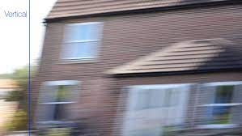
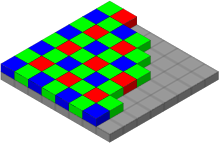

# Elementi sensibili

Lo stesso concetto di “fotografia” esiste prima ancora che per le macchine e per le ottiche per merito dei materiali sensibili.
La stessa evoluzione dei “supporti sensibili” per essere spiegata in toto necessiterebbe di un'enciclopedia dedicata e sarebbe comunque un bel problema soprattutto in virtù della smisurata quantità di brevetti e segreti industriali in gioco. Possiamo comunque sempre usare la tecnica del computer, chiunque può usarlo senza avere la minima idea di come funzioni realmente. 
Dopo i primi esperimenti “casalinghi” dei primi avventurieri in cui i risultati erano in verità molto variabili, ci fu chi (lo abbiamo già accennato) intuendo le potenzialità del settore scelse di trattare la questione industrialmente, seguito a breve da diversi altri sparsi per i vari continenti.

## La pellicola fotografica

Una pellicola fotografica è costituita da un supporto plastico, (acetato di cellulosa in origine poi sostituito con altri materiali a causa della sua estrema propensione alla combustione) su cui viene depositato uno strato uniforme e sottile  di gelatina (gelatina animale depurata trattata e stabilizzata) in cui sono state inglobate delle opportune miscele di cristalli di sali di argento.
Questi cristalli di sali di argento per poter in qualche modo reagire allo stimolo della luce, devono essere “drogati”, in pratica vengono introdotte delle sostanze capaci di interferire con la struttura del reticolo cristallino, le anomalie che si formano si comportano come delle “trappole” che bloccano il “naturale movimento” degli ioni d'argento. In sostanza la capacità di reagire alla luce dipende statisticamente dalla quantità di “irregolarità” del reticolo.
In un reticolo perfetto l’esposizione alla luce non creerebbe alcun effetto, un reticolo non perfetto riesce invece ad “intrappolare” gli ioni d’argento interstiziali eccitati dall’energia dei fotoni che lo hanno colpito.
Durante lo sviluppo la pellicola è immersa in un opportuno bagno chimico chiamato “rivelatore” quelle stesse irregolarità che hanno permesso la cattura degli ioni d’argento, permettono al bagno chimico di "entrare" in quel singolo cristallo e tramite opportune reazioni ridurlo dallo stato di “sale d’argento” a quello di argento metallico. Un successivo bagno chiamato “fissaggio” si occupa di rimuovere dalla pellicola tutti i cristalli di sali di argento “non contaminati dalla luce”.
Dopo opportuno lavaggio ed asciugatura quello che resta presente all’interno della gelatina è una quantità  di argento metallico distribuito statisticamente in base a quanto e dove la pellicola è stata illuminata.
Ovviamente in un secolo attivo come quello passato le evoluzioni dei materiali sono state a volte clamorose, e ovviamente le pellicole sono diventate molto più complesse della spiegazione semplicistica appena fatta, una “normale pellicola in bianco e nero” contiene granuli di alogenuri di argento di diverse dimensioni (e nelle ultime generazioni anche forma) dosate in precise percentuali. La dimensione dei cristalli resta la prima causa della sensibilità di una pellicola, più è grande un cristallo maggiori sono le probabilità di “inserire” difetti nel suo reticolo, ma come appena detto un cristallo esposto alla luce durante lo sviluppo viene “trasformato” in argento nella totalità della sua dimensione, e un granulo più grande produce inevitabilmente una “macchia oscura” più grande, che intuitivamente si traduce in un “minor dettaglio”. Il trucco è miscelare opportunamente le giuste quantità di grani grandi medi e piccoli per fare in modo che la pellicola possa restituire una bella gamma tonale dal nero al bianco, mantenendo una certa nitidezza nei dettagli, oltre ad una buona  “leggibilità sulle ombre” e “sulle luci”.
Tutto prevedendo il comportamento su base statistica; per avere una idea di quanto questo sia tutt'altro che scontato vale la pena citare un dato indicativo riguardo le quantità di materiale usato in test di preproduzione; Kodak (per fare un nome) “buttava” circa il 12% di ogni emulsione solo per avere la certezza di restare nei parametri.
Passare dal bianco nero al colore costringe ad ulteriori complicazioni.
Divene necessario disporre di almeno tre strati sovrapposti sensibili a diverse bande dello spettro. Ogni banda deve essere capace delle stesse prestazioni di una pellicola in bianco nero, in più ogni strato sensibile deve contenere delle sostanze (chiamate copulanti) che in fase di sviluppo si colorano nelle esatte proporzioni dell’argento metallico formato in ogni strato (come appena spiegato relativamente al bianco nero) e nell’esatto colore richiesto.
Una grande differenza nelle pellicole a colori (ma anche di alcune pellicole bianco nero di ultima generazione) riguarda la completa rimozione sia dei sali non esposti che dello stesso argento metallico. Questa stessa pratica di eliminazione dell’argento metallico in verità ha una storia piuttosto lunga, iniziata con delle pratiche definite “viraggi” nate per cercare di eliminare dai materiali sensibili tutte le cause di “naturale instabilità”.
Le pellicole a colori di ultima generazione sono arrivate a contare anche 12 strati sovrapposti, i bagni necessari per gli sviluppi necessitano di un controllo accuratissimo delle temperature, la base resta la gelatina animale, per la sua permeabilità ai bagni di sviluppo, trasparenza, flessibilità ecc, una temperatura superiore ai 39 gradi minerebbe gran parte delle sue caratteristiche fisiche.
Nonostante tutte le incertezze possibili, le pellicole disponibili sul mercato erano  precise, semplici da usare ed affidabili, tutto quello che poteva succedere era più o meno previsto su base statistica.
Quando il digitale si affacciò ai laboratori di ricerca (che erano gli stessi dove si costruivano le pellicole) bisognava poter ragionare su dati comparabili tra i due mondi e uno studio molto interessante per noi comuni mortali fu fatto dalla Kodak, che pubblicò delle stime in cui era possibile comparare la risoluzione  di pellicole standard e dei nuovi sensori elettronici.
Una pellicola formato 135 (il classico rullino per reflex) da 100 ISO (ISO è ancora l’unità di misura della sensibilità alla luce) se fosse stata “espressa in pixel” ne avrebbe avuti all’incirca 18.000.000.
Questo quando nei laboratori di ricerca si era riusciti ad inserirne nei prototipi di laboratorio “la bellezza” di 4.000.000.
La differenza tra i numeri dei due sistemi sembrava incolmabile ma una analisi più accurata la rendeva non del tutto veritiera nel mondo reale, c'erano dei problemi che avrebbero condizionato non poco i risultati reali. Il primo problema era relativo ai processi, un negativo per essere sfruttato necessita di una serie di passaggi ulteriori, fotoottici, ottici e chimici; di tempi per poterli effettuare; di produrre altri tipi materiali sensibili (carte) con conseguenti ulteriori materiali buttati in tarature e controlli qualità; di precisione nel trattamento dei processi, di mantenimento e rigenerazione dei bagni chimici.
Definire tutto questo un “cane che si morde la coda” era quantomeno riduttivo, si trattava di un “dinosauro che si morde la coda”.
Non aveva senso contrastare la rivoluzione digitale che avrebbe permesso di disporre di immagini senza troppi passaggi in modo più veloce e probabilmente più economico e nessuno ha mosso un dito per evitarla.

## I sensori elettronici

I primi sensori erano molto diversi dagli attuali, I sensori CCD  sono costituiti da una matrice di pixel affiancati orizzontalmente e verticalmente, ogni singolo pixel ha una costruzione piuttosto complessa in cui la parte effettivamente sensibile può essere veramente piccola (gli sviluppi tecnologici hanno aumentato di molto questa superficie) e anche “sprofondata” su un piano più interno al chip (non a caso nelle prime generazioni si parlava di “pozzo”).
La caratteristica fondamentale del loro funzionamento è già in qualche modo descritta nel nome: (tradotto letteralmente) “dispositivo ad accoppiamento di carica”.
In pratica un CCD non “legge la luce che lo colpisce” in senso assoluto, legge la differenza di cariche tra due pixel adiacenti, questo ne complica parecchio l’architettura ma permette di esibire prestazioni notevolissime. In pratica tutto inizia esponendo la matrice alla luce, durante questo periodo in ogni “pozzo” sensibile si accumulano delle cariche in proporzione alla quantità di luce  “caduta”, a questo punto per leggere le cariche è necessario trasferire l’intera “mappatura” della matrice o una linea alla volta in un registro di lettura (secondo l'architettura del sensore), operazione da fare al buio, ad otturatore chiuso; una volta nel registro di lettura tramite una scansione vengono “comparati” i valori tra pixel adiacenti e questo permette di ricostruire in uscita un segnale elettrico riga per riga (o quadro per quadro) dell’intera immagine catturata.
Il punto a favore del CCD era la qualità dell’immagine fornita, si trattava comunque di un dispositivo elettronico complesso in cui già solo l’essere "acceso" avrebbe portato nell'immagine una certa percentuale di rumore, ma il colpo di genio di leggere la differenza di cariche permetteva all’immagine letta di esserne in qualche modo "immune" almeno fin quando la quantità di luce fosse stata significativa.
I punti a sfavore erano la complessità del dispositivo, una certa lentezza, la necessità di oscurarlo durante il trasferimento delle cariche e (ma questa sarebbe stata poi ridotta con lo sviluppo) una percentuale sensibile troppo piccola rispetto all’intero pixel. Una prima soluzione a questo ultimo problema la portò la Sony mettendo una piccolissima lente avanti ad ogni pixel e sfruttando praticamente quasi tutta la superficie del pixel.

Il guadagno in luminosità fu nettissimo e qualcuno pensò di sfruttare questa tecnologia anche per compensare la perdita di luminosità ai bordi con raggi molto inclinati.

-------- TODO QUI CI VA UN'IMMAGINE -----------------

Personalmente considero ancora questa cosa una totale idiozia, posizionare una lente sopra un pixel largo come “il capello di un pidocchio di zanzara” potrebbe già essere “un tantino” complicato, figuriamoci organizzarsi in modo che ogni singola lente possa risultare via via sempre più disassata per cercare di compensare l’angolazione di un raggio di luce che poi cambiando ottica sarebbe diversa comunque. Però è giusto citarla perché quella cosa andò effettivamente in produzione e quella macchina fu una assoluta totale costosissima porcheria; la peggior cosa con su scritto Leica mai pensata e prodotta da mente umana. Considerando che neanche dieci anni prima la Leitz (proprietaria del marchio Leica) deteneva da sola circa il 40% dei brevetti (mondiali) sui processi di produzione dei vetri ottici qualcosa doveva essere successo, qualcosa di mostruosamente grande.
Parallelamente al CCD si facevano strada altri dispositivi strutturalmente meno complessi, i CMOS.
Questa volta il nome non dice niente, e per fortuna, visto che se ne fossero esistiti 10 tipi di 10 produttori diversi non avrebbero avuto niente altro in comune che il silicio usato come materiale base. Al di là di questo e del nome l’approccio era del tutto differente, ogni singolo pixel disponeva di una uscita in qualche modo definibile “diretta”.
Le maggiori differenze erano che: non era possibile “isolare il rumore durante la lettura”, ogni pixel era una struttura indipendente non del tutto identica a quello che aveva di fianco, e c’erano sempre delle piccole differenze, se il “tappeto del CCD” (il nero che si sarebbe visto al buio) poteva essere una matrice uniforme, il tappeto del CMOS era ancora fatto di tanti "quadratini" uno un filo più chiaro, uno un filo più scuro, guardandolo poi a colori la cosa diventava anche colorata… ma si trattava delle prime generazioni.
Godeva però di un grandissimo vantaggio, la velocità; non erano necessari passaggi intermedi, trasferimenti, letture, conversioni ecc, quello che entrava (come luce) poteva in qualche modo essere inviato in uscita (come segnale elettrico).
Lo sviluppo subì un'impennata tale che in pochissimi anni si era già alla terza generazione, i vecchi problemi di “uniformità” erano stati ridotti in maniera drastica e la spinta indirizzata verso i punti di forza portò a qualcosa di clamoroso, un singolo dispositivo (che comunque necessitava di un processore di gestione) che permetteva da una matrice di diversi milioni di pixel (già a cavallo dei 10) di fornire immagini fisse a piena risoluzione e simultaneamente flussi video in diversi tagli (non solo FullHD) il tutto senza alcun bisogno di dispositivi di otturazione meccanica della luce e senza praticamente problemi di interruzione per surriscaldamento del sensore e conseguente aumento del rumore.
Nell’ambiente fotografico si trattò di una rivoluzione totale che in pratica portò alla fusione dei “vecchi mondi” sempre separati di cinema e fotografia che per essere compresa del tutto avrebbe avuto bisogno di qualche tempo.         
Tuttavia un nuovo difetto era alle porte il famigerato "effetto tapparella” al secolo “Rolling Shutter”

-------- TODO QUI CI VA UN'IMMAGINE -----------------
-------- TODO QUI CI VA UN'IMMAGINE -----------------
-------- TODO QUI CI VA UN'IMMAGINE -----------------

Quello che succede è che comunque devono essere trasferiti diversi milioni di pixel ad un cervello che li elabora e ad un supporto, e non è possibile usare un filo per ogni pixel, sono flussi di dati in cui le uscite da ogni pixel devono “mettersi in fila per raggiungere il cervellone” solo che per quando è arrivato il segnale del millesimo pixel al primo la situazione è già cambiata completamente.
Oggi si parla di “Sensori Stacked” in pratica si tratta di una pila sovrapposta di strati funzionali, non ci sono colli di bottiglia, i dati passano simultaneamente al cervellone che li elabora e li rende disponibili.

## Il colore

La restituzione del colore in un sensore elettronico diventa un tantino complessa, sulle prime telecamere professionali come abbiamo accennato nel cap2 la questione veniva risolta alla radice usando tre sensori incollati con precisione su un prisma ottico capace di “dividere” in tre fasci separati l’immagine raccolta dall’ottica. Ogni sensore si occupava di un terzo della banda visibile, Uno per il rosso, uno per il verde e uno per il blu, tuttavia la presenza del prisma divisore sarebbe stata ancor più ingombrante di uno specchio reflex, e viste le misure dei formati fotografici anche molto pesante per cui alla fin fine impraticabile

-------- TODO QUI CI VA UN'IMMAGINE -----------------

Sono state percorse due strade, la prima, quella più diffusa è la “matrice bayer” (dal nome dell’ingegnere che pensò tale soluzione) la seconda (brevetto “Foveon” oggi di proprietà Sigma) quella di costruire un chip a strati sovrapposti in cui ognuno si occupa di una porzione della banda.
Alcuni costruttori hanno scelto delle varianti, tipo Fuij con la XTrans, che come la matrice Bayer delega al processore delle funzioni di interpolazione necessarie.
Entrambi i sistemi hanno come sempre vantaggi e svantaggi.

-------- TODO QUI CI VA UN'IMMAGINE -----------------
-------- TODO QUI CI VA UN'IMMAGINE -----------------

Il problema di fondo è come si sceglie di trattare il colore, paradossalmente in TV dove il prisma divisore  avrebbe permesso di disporre di tre immagini a piena risoluzione, una per ogni banda di colore, questa “abbondanza” non viene sfruttata in quanto il sistema televisivo per una serie di scelte tecniche è costituito da 3 segnali impacchettati insieme, il primo è una immagine a piena risoluzione in bianco nero, il secondo ed il terzo sono due segnali che trasportano le informazioni di colore della banda del rosso e del blu, questi due segnali sono perà a “banda dimezzata” non sono capaci di leggere i dettagli finissimi del segnale bianco nero, la banda del verde viene derivata per “sottrazione” dai segnali disponibili. Il nome di tale configurazione è YUV.
In fotografia poter disporre di segnali a piena risoluzione per ogni colore permetterebbe una notevolissima qualità, per cui il sistema Foveon sembrerebbe partire favorito, tuttavia lo sviluppo di sistemi complessi come i sensori di immagine necessita di una smisurata quantità di risorse tecniche e finanziarie, e poter sviluppare in proprio un sistema del genere non è affatto semplice, specie quando come ora la concorrenza è capace di continui cambi generazionali. Il sistema Bayer è al momento il più usato, ma necessita di un complesso trattamento a valle del sensore  capace di restituire dopo le dovute interpolazioni un'immagine di qualità nelle tre bande di colore.
Il futuro è sempre più vicino e non escluderei affatto che nel giro di qualche anno i filtri ottici possano addirittura scomparire sostituiti da un sistema di rilevamento elettronico delle lunghezze d’onda ed una ricostruzione accurata della percentuale di ogni banda in ogni singolo pixel.
Al momento il sistema più diffuso resta il Bayer, accoppiato a dei processori a bordo delle fotocamere che hanno raggiunto ormai prestazioni stellari, sia come velocità, sia come qualità. Il Foveon comunque continua un suo percorso di sviluppo  sulla base di una migliore “facilità nella capacità di restituzione del colore”. Fermo restando che nessuno senza una bacchetta magica potrà disporre di dati certi sulla tipologia di tecnologie adottate in futuro, sicuramente vedremo comunque un costante miglioramento della qualità.

## Ma cosa è la qualità?

Cosa permette ad una immagine digitale di essere migliore?
Le aziende produttrici sono coinvolte in una guerra senza esclusione di colpi fatta di ricerca, sviluppo, e soprattutto marketing, per poter affrontare le spese di ricerca e sviluppo bisogna vendere e per vendere bisogna che ricerca e sviluppo abbiano permesso la produzione di prodotti appetibili e quindi vendibili. Non se ne esce, per migliorare un prodotto bisogna spendere i soldi che si possono trovare solo nella vendita di un prodotto, che poi alla fine potrebbe anche non essere così appetibile ma deve necessariamente essere vendibile. Allora si può rendere più desiderabile migliorandone una parte, tipo magari il numero di pixel.
E qui la domanda del secolo, aumentare il numero di pixel migliora l’immagine? Non sempre e non del tutto. A parità di risoluzione un sensore meno “rumoroso” permette un miglioramento netto dell’immagine, a parità di rumore un sensore con più pixel “fornisce più informazioni” che potrebbero anche essere sfruttate se la qualità dell’immagine che si raccoglie (ovvero la qualità dell’ottica) è tale da produrre un miglioramento. In sostanza "sperare" che una fotocamera con un maggior numero di pixel sia capace di una qualità nettamente superiore resta soprattutto una speranza (che necessita di essere modulata dalla qualità effettiva di “tutta la catena” dall’ottica, all’esposizione). A fare da contraltare a questa speranza c'è però per ora una certezza, quella di continuare ad ingigantire i pacchetti con cui ogni singola foto (o video) viene confezionata, quasi una corsa senza fine alla ricerca di un inafferrabile astratto concetto di miglioramento ad ogni costo.
All'inizio mi sono permesso di definire questa fase "la preistoria dell'immagine digitale" ed ora parlare di "astratto miglioramento" può sembrare una contraddizione, ma il punto è un altro. Il punto è poter arrivare ad una maturità nella produzione svincolata dal concetto "comprami ho due pixel in più" a favore di punti di sviluppo meno "clamorosi" ma decisamente più significativi in un percorso di miglioramento effettivo dell'immagine.
Siamo già a livelli molto alti, se citiamo la sola sensibilità, oggi la misuriamo in "efficienza quantica", siamo passati da un misero 3% delle care pellicole ad un 80 % abbondante dei sensori più moderni.
Quello che 20 anni fa necessitava di formati di 4,5x6 cm oggi viene fatto con risultati migliori da un full frame. La possibilità di switchare uno stesso sistema da "foto" a "cine" è una realtà che pochi anni fa non avrebbe avuto prezzo. A livello computazionale, una macchina standard di oggi permette di affrontare situazioni che pochi anni fa erano impensabili. Un semplicissimo smartphone di oggi permette, pur con i suoi limiti geometrici, di affrontare una varietà di situazioni quasi sconfinata. Unico "piccolo" neo in tutto questo è forse probabilmente la perdita del gusto dello scatto, il "respiro del fotografo", fatto di situazioni pesate e pensate. La semplicità e l'economia con cui i sistemi moderni hanno permesso di acquisire le immagini hanno buttato alle ortiche anni di affinamento, di pulizia mentale, di curiosità nel guardare il mondo "attraverso il punto di vista di un amico".
È stato letto come primo fondamentale miglioramento "poter fare tutto con tutto", abbandonando le ottiche fisse a favore di sistemi capaci di incorporarne 3 nello stesso contenitore, dimenticando che non è una facoltà dell'ottica "portare il soggetto al fotografo", ma è il fotografo ad andare a prendere il soggetto usando di volta in volta l'ottica migliore alla situazione.
