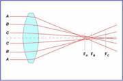
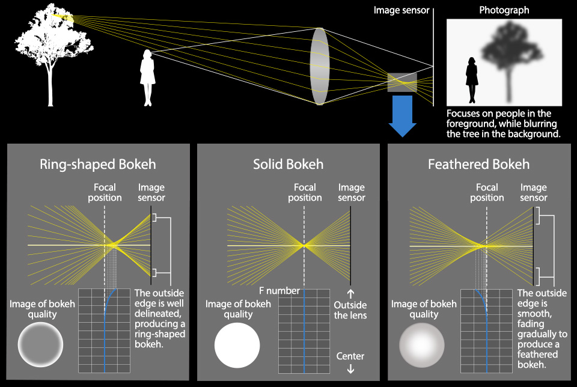
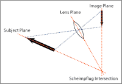
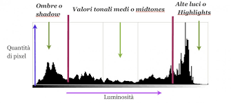
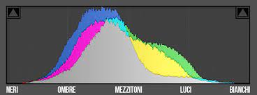

# Controllo della nitidezza e dell'esposizione
Ogni modalità di acquisizione di immagine sia essa statica o dinamica (in movimento), passa per due fasi fondamentali ed imprescindibili, quelle che poi determinano la effettiva visibilità e sfruttabilità del lavoro.
La questione è “solamente”  rendere i soggetti della acquisizione nitidi e visibili.
Qualsiasi sistema di acquisizione di immagini ha dei limiti fisici sia verso i livelli di luminosità registrabili sia a livello ottico (di questo abbiamo già discusso) per quanto riguarda la nitidezza. Si tratta di problemi conseguenti alla scelta del “punto nitido preferenziale”, quello che dà un senso effettivo a quello che stiamo facendo. In merito a questa seconda argomentazione è importante ricordare che la questione “nitidezza” non riguarda unicamente la “nitidezza ottica” quella legata alla “messa a fuoco” ma anche la possibilità che il soggetto non sia sufficientemente fermo durante la ripresa e produca un'immagine poco nitida in quanto costituita da una sovrapposizione di più immagini magari molto simili ma registrate su posizioni diverse nello stesso fotogramma o addirittura ad una “macchia strisciata”, quello che comunemente viene definito “mosso”.
Parlando della questione “fuoco” è bene ricordare che sostanzialmente si tratta di un “sottoprodotto dell’ottica” che da essa dipende totalmente e in qualche caso (come quello delle ottiche a fuoco fisso) anche inaccessibile al fotografo. 
Sul “mosso” senza entrare in merito al “senso pittorico del mosso” spesso cercato dai fotografi, ci dovremmo occupare unicamente del problema del mosso non voluto, quello che compromette la “nitidezza del soggetto”.
Ma praticamente cosa è la nitidezza?

## Nitidezza "ottica"
In un sistema ottico la nitidezza è un compromesso di prestazioni, o per dirla in un altro modo “il limite di progetto dell’ottica”.
La moderna “fotografia” (termine esteso al concetto di qualsiasi tipo di acquisizione di immagini) si basa su formati di acquisizione di ridotte dimensioni a fronte dei “formati di visualizzazione” di grandi o grandissime dimensioni, una cinepresa 35mm usa un fotogramma di circa 18x24 mm (dimensioni oggi in realtà piuttosto diverse) e da questo produce delle immagini finali sfruttabili dal pubblico di svariati metri quadrati; una fotocamera FF (24x36mm) usata da un fotografo di moda non raramente produce stampe delle dimensioni di intere facciate di palazzi. Sembrerebbe che al momento non ci sia un effettivo limite di “nitidezza” ma non è così, quando si progetta un sistema ottico la prima cosa fondamentale è appunto la scelta della massima nitidezza permessa; scelta che dipende strettamente da due fattori, il formato del sensore (o pellicola) ed il tipo di uso a cui il sistema è destinato.
Da un punto di vista fisico la finezza del dettaglio di un’ottica dipende anche dalle dimensioni delle lenti, maggiori sono le dimensioni delle lenti usate, diametro e spessore, minore sarà la massima nitidezza raggiungibile, per diversi motivi, primo tra tutti l’impossibilità di produrre vetri perfettamente trasparenti; questo limite cresce esponenzialmente aumentando le misure dei vetri coinvolti nel progetto. D’altra parte, un formato di dimensioni maggiori, pur dovendo usare lenti più grandi richiede comunque un minore ingrandimento.
C’è una misura fondamentale di ogni ottica legata alla  nitidezza massima raggiungibile, viene chiamato “cerchio di confusione” ed è in pratica, per fare un paragone comprensibile, la misura del “pixel” dell’ottica, potremmo dire che nelle ottiche destinate a grandi formati la misura di questo ipotetico “pixel” è molto maggiore di quelle destinate a formati piccoli. Sulle ottiche di un certo livello i produttori normalmente specificano anche di che dimensione stiamo parlando, specie su ottiche specialistiche quali quelle destinate alla macrofotografia; non è raro che talune categorie di ottiche siano pensate e costruite per essere effettivamente più nitide di altre.
Allo stesso modo una ottica da ritratto pensata per rendere più bello e piacevole il volto di una persona non avrà nessun motivo per estrarre dal soggetto i dettagli più fini, tanto che non sono rari i casi in cui in fase di progetto viene introdotta una percentuale di sfocatura a volte addirittura regolabile sovrapposta all’immagine nitida. Queste ottiche sono chiamate “a fuoco morbido”, possono sembrare strane e complicate ma si tratta “semplicemente” (tra virgolette perché le cose semplici non sono mai facili) di sfruttare un “difetto tipico di una lente a profilo sferico”: in pratica i raggi di luce che vengono raccolti dalle zone periferiche della lente hanno una lunghezza focale diversa di quelli raccolti nelle zone centrali, difetto conosciuto appunto con il nome di “aberrazione sferica”.

Un concetto talmente “funzionale” che oltre alle ottiche il mercato ha reso disponibili anche numerosi tipi di filtri aggiuntivi, famoso quello Zeiss a “fossette”, una lastra di vetro “pianparallela” (gli ottici sentono la necessità di usare nomi precisi che descrivono precisamente le cose…) “bersagliata” da  svariate fossette anche di dimensioni diverse disposte in modo quasi casuale. Queste “fossette” in pratica si comportano come delle piccolissime lenti negative che creano delle lievissime immagini fuori fuoco sovrapposte a quella principale, una piccola fossetta produrrebbe una immagine fuori fuoco talmente poco significativa da essere del tutto impercettibile, quando se ne mettono insieme diverse i risultati possono essere apprezzabili.
Passando ora dal piano ottico a quello “pittorico” cosa significa mettere a fuoco un soggetto? La risposta può essere affrontata a più livelli, da quello “base” (fai in modo che si veda) a quello raffinato, in cui tutto il senso dell’immagine è legato alla nitidezza di un dettaglio preciso, talmente preciso che se non c’è non funziona più niente.
Esiste però una zona di transizione tra il soggetto a fuoco e quello che più vicino o più lontano dal soggetto contribuisce a costruire una immagine, nel linguaggio comune viene spesso usato il termine “Bokeh” per indicare quel particolare contributo di sfocatura al soggetto in grado di dare un senso alla poesia dell’immagine.
Qui sotto una pubblicazione  Olympus-OM Digital Solution, in cui viene mostrato il “bokeh” costruito dal contributo di una opportuna “aberrazione sferica”, nei due casi in cui l’immagine fuori fuoco (quella raccolta dai bordi della lente) abbia una lunghezza focale minore o maggiore di quella nominale dell’ottica, notare la differenza provocata sul bordo dell’immagine fuori fuoco.

Tutto questo resta parte del “bagaglio proprio” dell’ottica usata al netto della nitidezza massima raggiunta nel punto di “perfetta” messa a fuoco.
Nelle ultime macchine i costruttori hanno introdotto dei sistemi di IA (intelligenza artificiale) per fare in modo che lo stesso autofocus della macchina possa capire certi dettagli fondamentali e metterli in evidenza rendendoli più nitidi di altri, una situazione classica è il riconoscimento facciale, in cui poi viene riconosciuto l’occhio più significativo, quello determinante a far funzionare l’immagine di un ritratto, situazione via via estesa al riconoscimento delle facce degli animali e altre “situazioni note” quali macchine da corsa in movimento.
In realtà insieme a questi casi “eclatanti” di fuoco esistono una infinità di situazioni più o meno gestibili dal sistema di ripresa.
Uno studio fotografico che ha la necessità di fotografare un camion deve fare in modo che la nitidezza sia ben più estesa del faro anteriore più “significativo”; un mezzo di dimensioni ciclopiche magari deve essere fotografato da una macchina di grande formato, che per definizione è “meno nitida” e usa lunghezze focali maggiori, che dispongono di “profondità di campo” meno estese (vedi il capitolo sull’[ottica](../cap3/cap3.md)). Tutti questi fattori insieme renderebbero la situazione piuttosto difficile da gestire se non ci fosse la fisica delle lenti.
Parte dei limiti ottici riguardanti la messa a fuoco dipende essenzialmente dal fatto che il sistema ottico sia montato perpendicolare al sensore, potendo inclinare opportunamente il sistema ottico potremmo trovare il modo di tenere a fuoco interi piani  inclinati.
Questa cosa ha un nome: “principio di Scheimpflug”, ed è il motivo per cui ancora oggi continuano ad esistere fotocamere che possono inclinare a piacimento e con precisione sia il piano che contiene il sensore sia quello che contiene l’ottica per fare in modo che un intero piano del soggetto risulti completamente a fuoco; solitamente è un argomento considerato molto specialistico, ma il mondo cambia.

Una delle funzioni più utili a disposizione oggi su una moderna fotocamera digitale è la stabilizzazione.
Dopo i primi tentativi piuttosto arcaici i moderni sistemi mantengono svincolato il sensore dal corpo macchina, fissato unicamente da una serie di motori elettrici. Un sofisticato sistema di giroscopi elettronici gestito dal cervello della macchina consente ai motori di mantenere il sensore fermo anche se le mani del fotografo si muovono e i gradi di libertà permessi dal sistema non si fermano alla semplice traslazione del sensore, viene controllata anche la rotazione in ogni direzione su qualsiasi asse, praticamente il piano del sensore può essere inclinato seppur di poco in qualsiasi direzione. Sebbene l’entità dei movimenti è al momento ancora piuttosto limitata, non escluderei che in un tempo non così lontano la macchina non possa permetterci di mettere a fuoco interi piani inclinati, ovviamente entro certi limiti.
La stabilizzazione nasce per attenuare i problemi del mosso, quella appena descritta è una possibilità aggiunta data dalla gestione elettronica della posizione del sensore; il fatto che al momento non venga gestita dal software della macchina è un limite irrilevante e probabilmente temporaneo, al momento quello che il cervello della macchina decide durante la stabilizzazione è la migliore procedura per “inseguire” il soggetto in tempo reale, sia che sia necessario traslare il sensore lateralmente sia che sia necessario ruotarlo intorno all’asse ottico o intorno ad un qualsiasi altro asse, quello che però non può conoscere è l’effettiva intenzione del fotografo.

## Nitidezza “dinamica”

Nell’uso pratico si tende a differenziare il concetto di messa a fuoco da quello di mosso, si tratta di situazioni totalmente diverse ma a livello “pittorico” le questioni possono essere molto simili.
Entrambi permettono nitidezza e quindi leggibilità maggiore o minore, entrambi permettono di essere “sfruttati” per isolare il soggetto da un contesto che può essere statico o dinamico.
Al contrario di quanto sia lecito aspettarsi il problema della nitidezza da mosso e la stabilizzazione a controllo elettronico possono essere in qualche modo in contrasto.
Poniamo ad esempio il caso limite che si stia fotografando un soggetto in rapido movimento che costringa il fotografo a muoversi molto velocemente, e che ci sia la volontà di usare tempi di otturazione ragionevolmente lunghi per poter evidenziare la sciata di mosso sullo sfondo mantenendo il soggetto ragionevolmente fermo e leggibile, come se “scorresse” sullo sfondo. Il controllo di stabilizzazione potrebbe scambiare per mosso “indesiderabile” il movimento della macchina e rendere la vita difficile al fotografo con una serie di aggiustamenti repentini impossibili da gestire.
Del resto anche in quella situazione si vorrebbe poter utilizzare il sistema di stabilizzazione della macchina perché magari si sta usando una focale piuttosto lunga con poca luce. Il problema di base sta nel far capire alla macchina che il mosso indesiderato non è quello rilevato dai giroscopi nel corpo macchina ma è quello relativo al soggetto che si sta inseguendo, e ovviamente non possiamo montare un giroscopio sul soggetto, questione di una certa complessità che per ora viene parzialmente risolta dicendo alla macchina in quale direzione assiale vorremmo una stabilizzazione, probabilmente a breve gli algoritmi IA interni riusciranno a capire e gestire meglio delle situazioni decisamente non facili.
In modalità “cine” quello definito “movimento di macchina”  è parte integrante delle azioni di ripresa e arriva anche oltre, visto che può esistere la situazione in cui in una ripresa si può decidere di far girare la macchina intorno al soggetto fermo o addirittura anch’esso in movimento; in situazioni di tali complessità è del tutto fuorviante affidarsi agli automatismi della macchina, la cosa più saggia resta l’impiego di sistemi di supporto “esterni” quali cavalletti, gimbal binari ecc. usati da anni per gestire le varie situazioni di mosso nei movimenti di macchina.

## Esposizione

Cosa si intende per controllo dell’esposizione?
Un sensore di immagine o una pellicola ha dei limiti di sensibilità riguardo la quantità di luce che riesce a registrare o a trasformare in segnale elettrico, funziona in un particolare range, se la luce è troppo poca non riesce a distinguerla e non si vede altro che nero, se è troppa “buca” e finisce per produrre una macchia bianca in cui niente altro è visibile oltre al bianco.
Il gioco consiste nel far cadere le varie luminosità di nostro interesse nel range registrabile dalla macchina, fermo restando che sforando in una delle due direzioni si potranno solo perdere dei dettagli.
Queste due zone limite del nero e del bianco possono essere in qualche modo spostate su livelli di luminosità più o meno alti, e questo in sostanza è quello che si fa regolando la sensibilità della macchina o della pellicola.
Per decenni i fotografi hanno usato tabelle e strumenti tarati su unità di misura in qualche modo riferite a scene dalla luminosità riconoscibile. Famosa la regola del 16, che suggerisce che in pieno sole basta partire da un diaframma 16 e impostare un tempo di scatto simile al valore di sensibilità della pellicola. Per esempio per una pellicola da 125 ISO e una scena in pieno sole una volta impostato il diaframma ad  f16 basta impostare il tempo ad 1/125 di secondo. Usando una 400 ISO basta portare il selettore dei tempi sul valore più vicino a 400 ovvero 1/500 di secondo.
A livello pratico se prima tutto era derivato dalla sensibilità della pellicola scelta, ora con le macchine digitali non è richiesto neanche questo, dato che nella funzione “auto” la stessa macchina provvede anche a scegliere la sensibilità da usare per una data illuminazione, va comunque considerato che al variare della sensibilità cambia anche il rumore visibile nella foto e in sostanza il livello di qualità della stessa per cui scegliere al posto della macchina diventa semplicemente preferibile quando si vuole ottenere un risultato prefissato e diventa addirittura obbligatorio quando si richiede una coerenza tra diversi scatti fatti magari nello stesso luogo in zone con diverse illuminazioni, la macchina potrebbe preferire variare di molto la sensibilità per mantenere magari una certa facilità di scatto, ma poi potremmo trovarci risultati completamente diversi nella grana e nella resa generale.
La scala ISO di sensibilità permette di usare un qualsiasi esposimetro anche esterno e avere una eccellente accuratezza in molte situazioni. Alcuni piuttsto sofisticati (e costosi) permettono la misura definita “spot” di una piccola zona dell’area (inquadrata tramite un mirino), misura che può essere ripetuta per diversi punti relativi a diverse zone, tra i quali uno può anche essere definito “bianco” o “nero” per essere considerato la massima luminosità registrabile della scena o la minima, una volta fatte le rilevazioni si dispone di valori precisi di tempi e diaframmi, o se si sta facendo un filmato, del tempo definito in "fotogrammi per secondo".
Le scale ISO non sono cambiate per cui le stesse regole "in vigore" con la pellicola sono ancora usate, tuttavia va considerato che le moderne macchine digitali leggono finezze che le vecchie pellicole neanche notavano, e di contro mal sopportano sforamenti verso il nero e ancor più verso il bianco, ma d’altro canto le macchine digitali sono anche dotate di eccellenti sistemi di interni di misurazione della luce.
Una grande differenza tuttavia si è venuta determinando con ripetuti anni di esperienza e uso pratico, anni in cui i produttori di pellicole hanno avuto modo di affinare certe caratteristiche delle pellicole per fare in modo che potessero leggere in certe condizioni quello che risultava visibile ad un occhio umano; impresa dalla difficoltà ciclopica. Ma come sempre accade in queste situazioni, pur non raggiungendo minimamente le caratteristiche della visione umana sono emersi dei punti fermi che nel salto digitale hanno avuto enormi difficoltà. Una caratteristica fondamentale della visione umana sta nel riuscire a “modulare” la sensibilità in funzione della quantità di luce, potremmo dire che l’occhio ha una risposta “logaritmica” mantenendo altissima sensibilità in situazioni di scarsa illuminazione diminuendola man mano che i livelli di illuminazione crescono.  Nel passaggio al digitale  venne stabilito che un occhio normale poteva distinguere livelli di illuminazione tali da essere registrati con una quantizzazione ad 8 bit, successivamente si è verificato tuttavia che in fase di “acquisizione” questo valore era decisamente insufficiente, in quanto appena sufficiente ad avere una risposta lineare del sensore, questa “linearità” era stata abbandonata dalle pellicole dagli anni trenta del secolo scorso, da allora tutte le pellicole avevano una maggiore sensibilità “nelle ombre” e una sorta di “compressione” verso le alte luci, situazione che per essere gestita a livello chimico necessitava di sapienti miscelazioni di granuli di sensibilità diverse, a livello elettronico in digitale di un numero di bit di acquisizione nettamente superiore agli 8, tanto che oggi lo “standard” ne prevede 14, detto in altri termini siamo passati dalla possibilità di registrare 256 sfumature di grigio dal nero al bianco alle attuali 16.384, un valore “solo” sessantaquattro volte maggiore a quanto ipotizzato in origine.
Nella vita normale è comunque buona norma tenersi lontani da tutte quelle luminosità che la macchina non riesce a registrare e che possono essere elemento di disturbo del soggetto, esistono tuttavia situazioni in cui i mezzi a disposizione possono permettere persino di gestire fisicamente l’illuminazione di scene che "nel mondo reale" sarebbe impossibile rendere fruibili. Ad esempio in cinematografia non è raro schiarire zone troppo buie in esterni ed in pieno sole per fare in modo che anche "agli occhi di una pellicola" la loro visibilità sia giusta nella scena.

## Come regolare l’esposizione?

La macchina quasi sempre dispone di un sistema di misura della luce della scena che si sta inquadrando, e a volte è anche dotata di sistemi intelligenti che le permettano di capire di che soggetto si tratta e come andrebbe esposto, tuttavia si tratta di ipotesi derivate da una serie di campioni in memoria che si suppone possano assomigliare a quello che si sta cercando di fare. Sono ipotesi basate sulle luminosità lette dalla scena inquadrata, situazioni permesse dalle ultime generazioni di macchine "intelligenti" che permettono al cervello di analizzare ogni singolo pixel. Il sistema di analisi di una macchina digitale è quasi perfetto, fornisce solitamente anche un istogramma, un grafico in cui vengono mostrati tutti i livelli di luminosità rilevati, che permette di visualizzare facilmente che tutto sia entro il range utile.

Si tratta di una analisi piuttosto dettagliata che volendo mostra anche dati relativi ad ogni singola banda di colore.

Al di là delle diverse tipologie implementate, sulle ascisse vengono visualizzati tutti i livelli di luminosità dal nero al bianco, spesso due linee di riferimento delimitano delle “bande di sicurezza” relative  alla visibilità certa del nero e del bianco; sulle ordinate invece viene visualizzata la quantità di questi livelli “trovati sparsi” per il fotogramma.
Se questo grafico mostra di essere oltre le zone di sicurezza è fisiologico che qualcosa di inquadrato non potrà essere registrato dalla macchina; un problema tuttavia è che si tratta di analisi disponibili dopo aver scattato, mentre per definizione in fotografia è necessario essere pronti a catturare una scena ancora non espressa.
Per questo può essere molto più utile e preciso misurare direttamente la luce che cade sul soggetto, specie se è necessario un controllo accurato delle luci della scena.
In queste situazioni può essere indispensabile affidarsi ad un sistema esposimetrico esterno e andare a misurare più che le luminosità emesse dai soggetti la quantità di luce che li investe, e solo eventualmente per un ulteriore riscontro, verificare anche le luminosità restituite viste dalla macchina da presa.
Ovviamente si tratta di misure che necessitano di strumenti appositi per niente economici, ma quando ci sono le condizioni risultano estremamente didattici e piacevoli nell’uso.
Potendo disporre di un ottimo esposimetro e un ottimo termocolorimetro si può analizzare con precisione qualsiasi condizione di illuminazione e avendo poi a disposizione mezzi opportuni, affrontare qualunque situazione di ripresa.
Se proprio vogliamo cercare una regola nell’esposizione metterei al primo posto di evitare la pigrizia, ci sono situazioni affrontabili con semplicità ed altre che necessitano di suppellettili, se la scena non è adatta ad essere ripresa bisogna essere fermi, o non si fa perchè poi non sarà utilizzabile o se si decide di farla bisogna armarsi di coraggio e usare tutto l’usabile per renderla fattibile, che letteralmente può significare montare luci, usare gelatine di filtro, di attenuazione ecc.
In una situazione che può richiedere una estrema precisione non è affatto raro impiegare giornate intere ad aggiustare dettagli fini di illuminazione che ai non addetti ai lavori possono sembrare del tutto insignificanti.